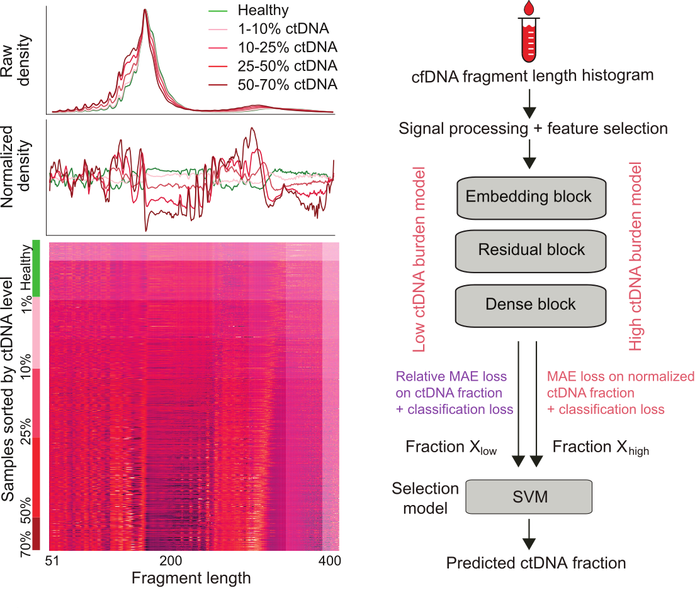

# Fragle
Fragle is a fast and versatile method for detection and quantification of circulating tumor DNA (ctDNA) in blood plasma samples. Fragle is cancer-agnostic (tested across 8+ cancer types) and works from both plasma lpWGS (as low as ~0.05X) and targeted sequencing data.<br>
<div align="center">
  
</div>

## Installation
- Download and unzip the Fragle source code (https://github.com/skandlab/FRAGLE/archive/refs/heads/main.zip).

**Installing software dependencies**:
- You need to have `conda` available in your system.
- Download `Fragle.tar.gz` file from [Zenodo](https://zenodo.org/records/13968359).
- Command for using `Fragle.tar.gz` file for installation (see [Conda Pack](https://conda.github.io/conda-pack/) for more details):
  - `mkdir -p ./Fragle` (creating directory for unpacking)
  - `tar -xzf Fragle.tar.gz -C ./Fragle` (unpack the archive)
  - `source ./Fragle/bin/activate` (activate the environment)
    - Now, `Fragle/bin` is added to your path.
    - You can now run Fragle software.
  - `source ./Fragle/bin/deactivate` (deactivate environment)
 
**Installing software dependencies (alternative method)**:
- If you fail to install the software using the `Fragle.tar.gz` file, then you can manually install the following software libraries instead:
  - `Python 3.7+`, `Sklearn 1.2.2`, `Pandas`, `PyTorch` (CPU version), `Numpy`, `Pysam`, `SAMtools`
  - Use `pip` or `conda` to install the above-mentioned software libraries
  - You can use the PyTorch GPU version as well; make sure to install the appropriate GPU driver and CUDA version (see [PyTorch documentation](https://pytorch.org/))


## Fragle Input and Output Overview
- **Input**:
  - Path of a directory with plasma sequencing BAM files / a single BAM file:
    - All BAM files inside this input directory must be of one type (WGS or targeted sequencing).
    - All BAM files must be mapped to a specific reference genome (hg19 / GRCh37 / hg38).
    - The index file (.bai) must be provided with each BAM file.
  - In case the input consists of one or more targeted sequencing BAM files, you will also need to provide the BED file containing on-target sequenced regions.
- **Output**:
  - Fragle predicted ctDNA fractions for all input BAM files.
  - Processed feature file (.pkl) used by the Fragle models.
  - Off-target BAM files (if targeted sequencing BAM files are provided).
- **Example**:
  - Example BAM files are provided inside the `Input/` folder.
  - Outputs for the example BAM files can be found inside the `Output/` folder.
  - You can run the software on the example BAM files in the `Input/` folder and verify that the outputs match those in the `Output/` folder.


## Running Fragle
Inside the Fragle software folder, run the following commands:

- Command:
    ```bash
    python main.py --input <INPUT> --output <OUTPUT_FOLDER> --mode <MODE> --genome_build <GENOME_BUILD> --target_bed <TARGET_BED> --cpu <CPU> --threads <THREADS>
    ```
- Command Line Argument Description:
    - **INPUT**: Input folder path full of bam files (or path to a single BAM file) [required string type argument]
    - **OUTPUT_FOLDER**: Output folder path where the Fragle predictions, processed features, and off-target bam files (in case of targeted sequencing bam files) will be generated [required string type argument]
    - **MODE**: [required string type argument]:
        - 'R': run Fragle on raw WGS bam files (or off-target bam files).
        - 'T': run Fragle on targeted sequencing bam files (containing both on and off-target reads); this mode also requires the **TARGET_BED** option.
        - 'F': run Fragle directly on processed features obtained from raw bam files (e.g., `Output/data.pkl`).
    - **GENOME_BUILD**: Specify reference genome version. [optional string type argument]
        - 'hg19': (default option) if your bam is mapped to hg19 or GRCh37 reference genome.
        - 'hg38': if your bam is mapped to hg38 reference genome.
    - **TARGET_BED**: bed file path for targeted sequencing bam file [optional string type argument]
        - This argument is only used when 'T' option is provided, meaning that you are running Fragle on targeted sequencing data files.
        - The bed file is used to derive the off-target bam files from targeted sequencing data (the off-target bam files will be generated inside the **OUTPUT_FOLDER**).
    - **CPU**: Number of CPU cores to use for parallel processing [integer type optional argument, default: 32]
        - If your running environment has multiple processors/cores, setting CPU to a value (e.g., 16 or 32) corresponding to number of available cores is recommended.
        - A higher CPU core value (if available) will significantly speed up the software execution.
    - **THREADS**: Number of threads to use for off-target bam file extraction [integer type optional argument, default: 32]
        - This argument is only utilized when the 'T' option is provided, meaning that you are running Fragle on targeted sequencing data.
        - A higher THREADS (if available) value will make the off-target bam extraction process significantly faster.

## Example Running Commands for Fragle
- **Running Fragle on hg19 mapped WGS BAM files:**
    ```bash
    python main.py --input Input/ --output Output/ --mode R
    ```
- **Running Fragle on single hg19 mapped WGS BAM file (file-centric run):**
    ```bash
    python main.py --input Input/input.bam --output Output/ --mode R
    ```

- **Running Fragle on hg38 mapped WGS BAM files:**
    ```bash
    python main.py --input Input/ --output Output/ --mode R --genome_build hg38
    ```

- **Running Fragle on GRCh37 mapped targeted sequencing BAM files:**
    ```bash
    python main.py --input Input/ --output Output/ --mode T --target_bed my_target.bed
    ```

- **Running Fragle on hg38 mapped BAM files containing only off-target reads:**
    ```bash
    python main.py --input Input/ --output Output/ --mode R --genome_build hg38
    ```
- **Running Fragle on hg38 mapped targeted sequencing BAM files utilizing 16 CPU cores and 16 threads:**
    ```bash
    python main.py --input Input/ --output Output/ --mode T --genome_build hg38 --target_bed my_target.bed --cpu 16 --threads 16
    ```
- **Running Fragle on hg38 mapped single targeted sequencing BAM file (file-centric run):**
    ```bash
    python main.py --input Input/target_sample.bam --output Output/ --mode T --genome_build hg38 --target_bed my_target.bed
    ```

- **Running Fragle on processed feature file (`data.pkl`) located inside `Input/` folder:**
    ```bash
    python main.py --input Input/ --output Output/ --mode F
    ```


## Additional Information
- You will see the following files created in the specified output folder after running Fragle:
    - **data.pkl**: Feature file created in 'R' and in 'T' mode → used by the models for ctDNA fraction prediction
    - **HT.csv**: ctDNA predictions obtained from Fragle high ctDNA burden model
    - **LT.csv**: ctDNA predictions obtained from Fragle low ctDNA burden model
    - **Fragle.csv**: Final ctDNA predictions generated by the Fragle software
    - **off_target_bams/**:
        - This folder is created only when 'T' mode is used
        - It contains off-target BAM files and corresponding index files extracted from the targeted BAM files
- If the coverage of any BAM file is too low (less than 0.025X), the software will generate a warning message for that BAM file besides generating the ctDNA fraction.


## Runtime and Memory Requirements:
- **20 MB memory** is sufficient to run Fragle.
- This memory requirement remains constant even if you vary:
    - Number of BAM files in your input directory
    - Sequencing depth of the BAM files in your input directory
- **No GPU** is required
- It takes around **50 seconds** for Fragle to predict ctDNA fraction from a 1X-coverage WGS BAM utilizing only 1 CPU core. The runtime can be reduced to **~3 seconds** if you use the default CPU core number of 32.
- The runtime increases approximately **linearly** with the **increase of sequencing depth**


## Contacts
If you have any questions or feedback, please contact us at:<br>
rafeed.rahman015@gmail.com<br>
skanderupamj@gis.a-star.edu.sg
